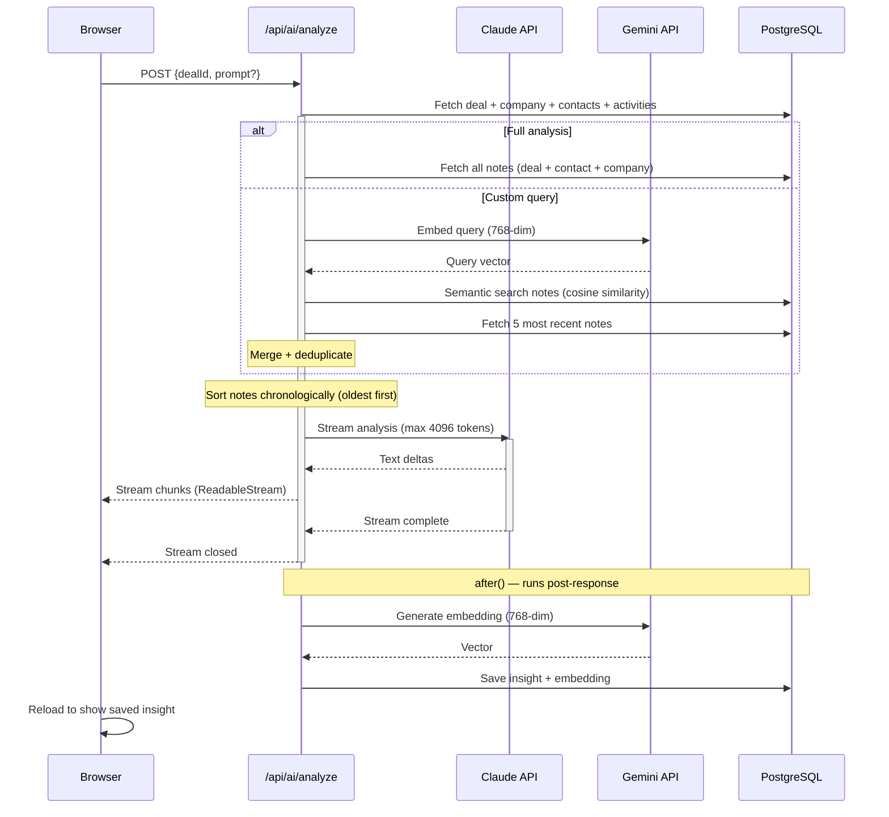

# AI Pipeline

Claude handles all natural language AI tasks (analysis, scoring, research, outreach, next steps). Gemini is used only for embeddings.

## AI Actions

| Action | Provider | Model | Purpose |
|--------|----------|-------|---------|
| Deal analysis | Claude | `ANTHROPIC_MODEL` env var | Full structured analysis (company, decision-maker, risks, approach) |
| Custom analysis | Claude | `ANTHROPIC_MODEL` env var | Answer a specific question about a deal |
| Deal scoring | Claude | `ANTHROPIC_MODEL` env var | Score 1-100 with weighted factors (JSON output) |
| Company research | Claude | `ANTHROPIC_MODEL` env var | Company summary, landscape, pain points |
| Outreach draft | Claude | `ANTHROPIC_MODEL` env var | Personalized email under 150 words |
| Outreach rewrite | Claude | `ANTHROPIC_MODEL` env var | Full or partial email regeneration |
| Next steps | Claude | `ANTHROPIC_MODEL` env var | 2-3 actionable steps with timelines (JSON output) |
| Token counting | Claude | `ANTHROPIC_MODEL` env var | Exact token count per note (fire-and-forget on create/update) |
| Embeddings | Gemini | gemini-embedding-2-preview | 768-dim vectors for semantic search (insights + notes) |
| Semantic note retrieval | Gemini | gemini-embedding-2-preview | Embed custom query → cosine similarity against note embeddings |

## Key Details

- **Streaming**: Both `/api/ai/analyze` and `/api/ai/outreach` stream Claude responses. Other AI actions return complete responses via server actions.
- **Embedding pipeline**: After the stream closes, `after()` from `next/server` runs embedding generation + DB persistence post-response. Gemini embeds the analysis text into a 768-dim vector stored alongside the insight. This powers `semanticSearch()` and `findSimilarDeals()`. Notes also get embeddings (fire-and-forget on create/update) powering `findRelevantNotes()`. HNSW indexes on `vector_cosine_ops` accelerate similarity queries.
- **Notes in AI context**: Full analysis includes all auto-surfaced notes (deal + all associated contacts + company), sorted chronologically oldest→newest. Custom queries use semantic retrieval (embed question → cosine similarity search → merge with 5 most recent → sort chronologically). Prompts instruct the AI that most recent notes take precedence when information conflicts.
- **Token counting**: `claude.messages.countTokens()` provides exact token counts per note (stored in `notes.token_count`). Displayed as a badge on detail pages. Runs in `after()` alongside embedding generation — lifecycle-safe fire-and-forget.
- **Prompts**: All system prompts are in `src/lib/ai/prompts.ts` — structured with explicit output format instructions, temporal precedence rules for notes.
- **Token limits**: Streaming analysis capped at 4096 tokens, streaming outreach at 1024 tokens, server action calls at 2048 tokens.
