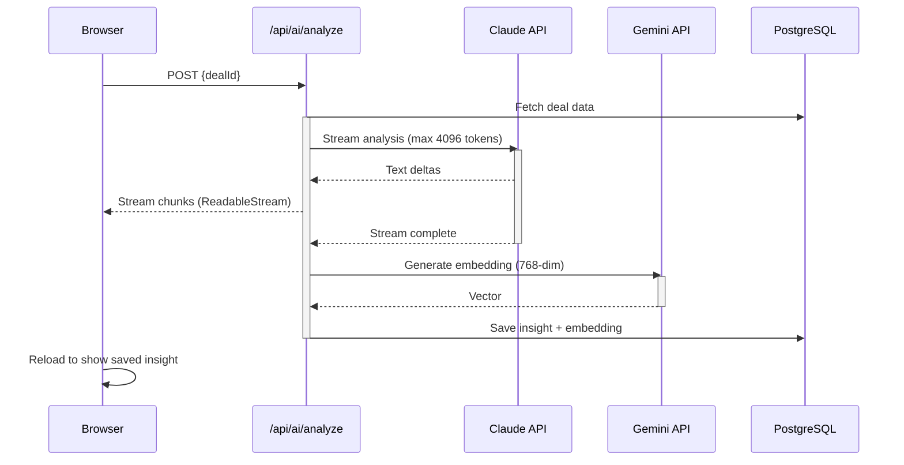

# AI Pipeline

Claude handles all natural language AI tasks (analysis, scoring, research, outreach, next steps). Gemini is used only for embeddings.

## AI Actions

| Action | Provider | Model | Purpose |
|--------|----------|-------|---------|
| Deal analysis | Claude | `ANTHROPIC_MODEL` env var | Full structured analysis (company, decision-maker, risks, approach) |
| Custom analysis | Claude | `ANTHROPIC_MODEL` env var | Answer a specific question about a deal |
| Deal scoring | Claude | `ANTHROPIC_MODEL` env var | Score 1-100 with weighted factors (JSON output) |
| Company research | Claude | `ANTHROPIC_MODEL` env var | Company summary, landscape, pain points |
| Outreach draft | Claude | `ANTHROPIC_MODEL` env var | Personalized email under 150 words |
| Outreach rewrite | Claude | `ANTHROPIC_MODEL` env var | Full or partial email regeneration |
| Next steps | Claude | `ANTHROPIC_MODEL` env var | 2-3 actionable steps with timelines (JSON output) |
| Embeddings | Gemini | gemini-embedding-2-preview | 768-dim vectors for semantic search |

## Key Details

- **Streaming**: Both `/api/ai/analyze` and `/api/ai/outreach` stream Claude responses. Other AI actions return complete responses via server actions.
- **Embedding pipeline**: After Claude generates analysis text, Gemini embeds it into a 768-dim vector stored alongside the insight. This powers `semanticSearch()` and `findSimilarDeals()`. HNSW index on `vector_cosine_ops` accelerates similarity queries.
- **Prompts**: All system prompts are in `src/lib/ai/prompts.ts` -- structured with explicit output format instructions.
- **Token limits**: Streaming analysis capped at 4096 tokens, streaming outreach at 1024 tokens, server action calls at 2048 tokens.
