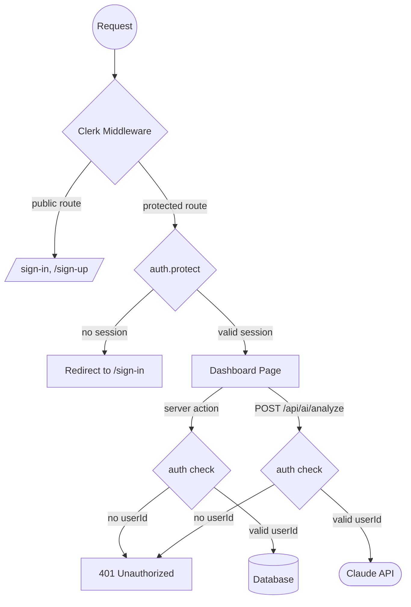

# Auth Flow

Clerk handles authentication with middleware-level route protection and server action validation.

## Key Details

- **Middleware** lives in `src/proxy.ts` (not `middleware.ts`) — Clerk convention with `createRouteMatcher`
- **Public routes**: `/sign-in(.*)`, `/sign-up(.*)` — everything else is protected
- **Server actions** independently validate auth — defense in depth, not just middleware
- **API route** (`/api/ai/analyze`) also validates auth before streaming Claude responses
- **Matcher** skips Next.js internals (`/_next/`) and static files but always runs for `/api/` routes
