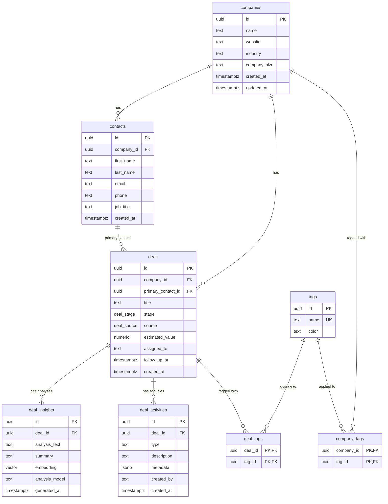

# Data Model

Drizzle ORM schema with 8 tables. Defined in `src/db/schema.ts`.

## Key Details

- **Enums**: `deal_stage` (new, contacted, qualifying, proposal_sent, negotiating, nurture, won, lost), `deal_source` (website, referral, linkedin, conference, cold_outreach, other)
- **Cascade deletes**: deleting a company cascades to contacts and deals. Deleting a deal cascades to insights, activities, and tag associations. Contacts referenced as primary contact use `ON DELETE RESTRICT`.
- **Unique constraint**: `contacts(company_id, email)` prevents duplicate contacts per company
- **Vector column**: `deal_insights.embedding` is 768-dim (Gemini `gemini-embedding-2-preview`) with HNSW index (`vector_cosine_ops`) for semantic search
- **RLS**: enabled on `deals` table — authenticated Clerk users get full access, anon role blocked. Enforced on Supabase Realtime subscriptions.
- **Activity metadata**: `jsonb` stores structured data like `{ from_stage: "new", to_stage: "contacted" }` for stage changes
- **Indexes**: stage, company_id, assigned_to, created_at, primary_contact_id on deals; deal_id on insights and activities; tag_id on junction tables
- **Gmail tokens**: `gmail_tokens` table stores per-user OAuth credentials (clerk_user_id unique) for outreach integration
