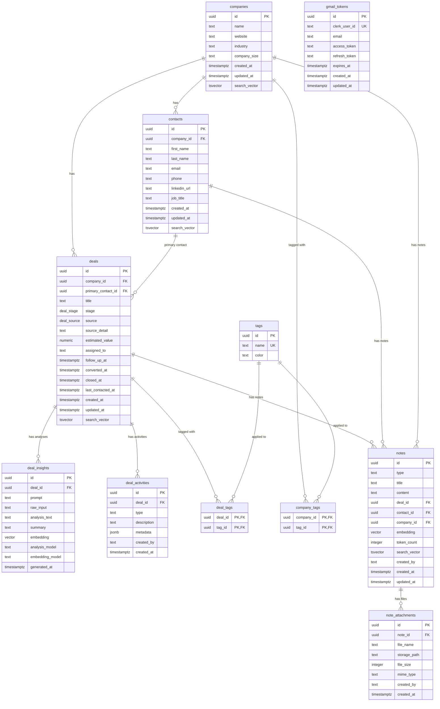

# Data Model

Drizzle ORM schema with 11 tables. Defined in `src/db/schema.ts`.

## Key Details

- **Enums**: `deal_stage` (new, contacted, qualifying, proposal_sent, negotiating, nurture, won, lost), `deal_source` (website, referral, linkedin, conference, cold_outreach, other)
- **Cascade deletes**: deleting a company cascades to contacts and deals. Deleting a deal cascades to insights, activities, and tag associations. Contacts referenced as primary contact use `ON DELETE RESTRICT`.
- **Unique constraint**: `contacts(company_id, email)` prevents duplicate contacts per company
- **Vector column**: `deal_insights.embedding` is 768-dim (Gemini `gemini-embedding-2-preview`) with HNSW index (`vector_cosine_ops`) for semantic search
- **RLS**: enabled on all tables except `note_attachments` — authenticated Clerk users get full access, anon role blocked. `gmail_tokens` has an additional explicit deny-anon policy. RLS on `deals` enforced on Supabase Realtime subscriptions.
- **Note attachments**: stored in Supabase Storage (`note-attachments` bucket), metadata in `note_attachments` table. Cascade-deleted with parent note. No RLS (accessed only via server-side admin client).
- **Notes**: multi-entity association via nullable FKs (`deal_id`, `contact_id`, `company_id`). CHECK constraint requires at least one non-null FK. Types: `note`, `transcript`, `document`. Content stored as markdown. 768-dim embedding (Gemini) with HNSW index for semantic search. `token_count` column stores exact Claude token count. Auto-surfaced on deal pages across deal + contact + company.
- **Activity metadata**: `jsonb` stores structured data like `{ from_stage: "new", to_stage: "contacted" }` for stage changes
- **Indexes**: stage, company_id, assigned_to, created_at, primary_contact_id on deals; deal_id on insights and activities; composite `(deal_id, created_at DESC)` on activities and `(deal_id, generated_at DESC)` on insights for detail page queries; tag_id on junction tables; GIN indexes on search_vector for companies, contacts, and deals
- **Gmail tokens**: `gmail_tokens` table stores per-user OAuth credentials (clerk_user_id unique) for outreach integration
