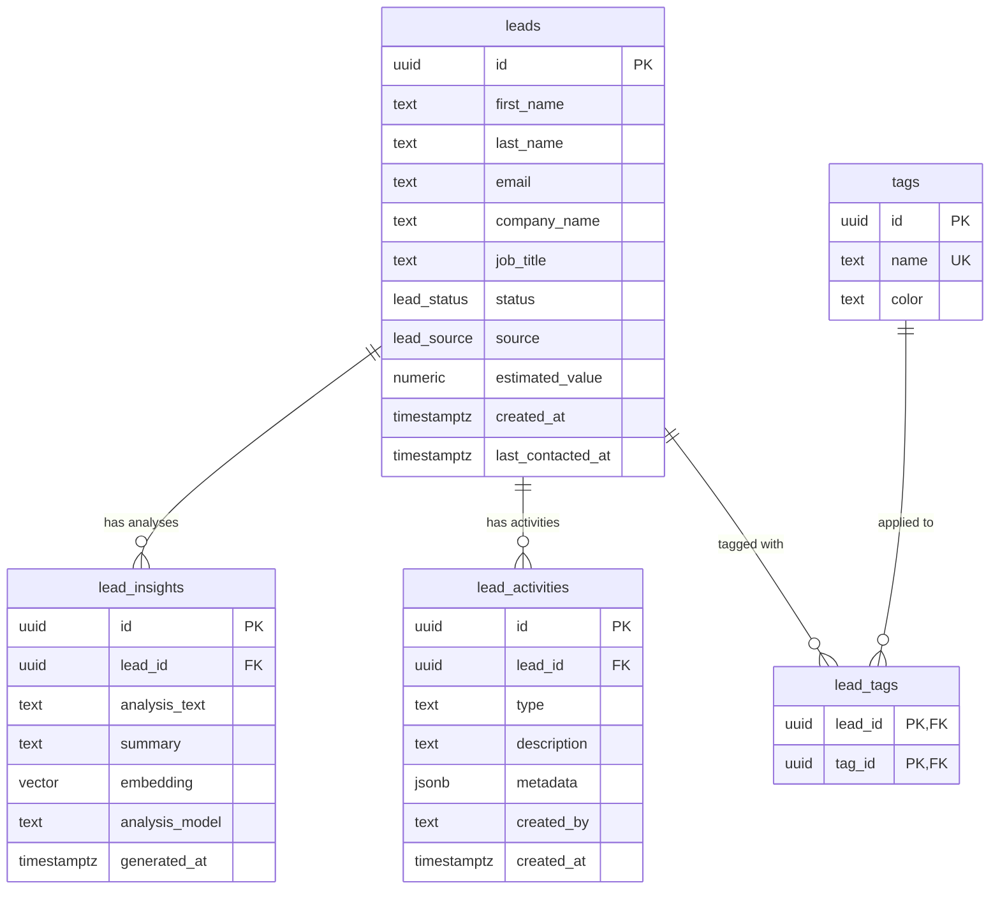

# Data Model

Drizzle ORM schema with 5 tables. Defined in `src/db/schema.ts`.

## Key Details

- **Enums**: `lead_status` (new → contacted → qualifying → proposal_sent → negotiating → won/lost/churned), `lead_source` (website, referral, linkedin, conference, cold_outreach, other)
- **Cascade deletes**: deleting a lead cascades to insights, activities, and tag associations
- **Vector column**: `lead_insights.embedding` is 768-dimensional (Gemini `gemini-embedding-2-preview`), used for semantic search and similar lead discovery
- **Activity metadata**: `jsonb` field stores structured data like `{ from: "new", to: "contacted" }` for status changes
- **Indexes**: status, assigned_to, created_at, company_name on leads; lead_id on insights and activities
