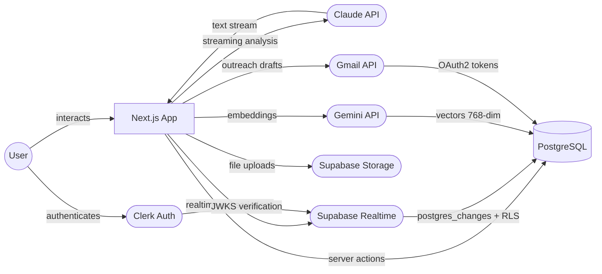

# System Architecture

High-level view of service boundaries and data flow.

## Key Details

- **Next.js 16 App Router** — server components by default, client components only for interactivity (forms, DnD, realtime)
- **Clerk middleware** (`src/proxy.ts`) intercepts all requests before they reach page components
- **Server actions** handle all DB mutations — no client-side DB access. Each action validates auth via `auth()`
- **Supabase** is used for Realtime subscriptions (Kanban board live sync) and file storage (note attachments via `note-attachments` bucket). DB queries go through Drizzle ORM directly to Postgres. Realtime is authenticated via Clerk third-party JWT — Supabase verifies tokens against Clerk's JWKS endpoint. RLS enabled on all tables except `note_attachments`; `gmail_tokens` has an additional explicit deny-anon policy.
- **AI calls** are server-side only — API keys never reach the client. Both `/api/ai/analyze` and `/api/ai/outreach` stream Claude responses to the browser via `ReadableStream`
- **Gmail integration** — OAuth2 flow via `googleapis`, tokens stored in `gmail_tokens` table. Used to auto-draft outreach emails on deal stage transitions (new → contacted)
