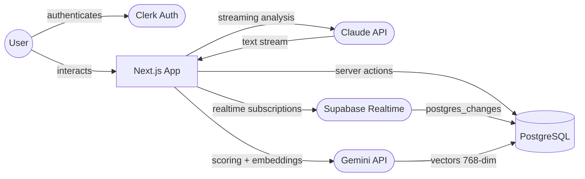

# System Architecture

High-level view of service boundaries and data flow.

## Key Details

- **Next.js 16 App Router** — server components by default, client components only for interactivity (forms, DnD, realtime)
- **Clerk middleware** (`src/proxy.ts`) intercepts all requests before they reach page components
- **Server actions** handle all DB mutations — no client-side DB access. Each action validates auth via `auth()`
- **Supabase** is used only for Realtime subscriptions (Kanban board live sync). DB queries go through Drizzle ORM directly to Postgres
- **AI calls** are server-side only — API keys never reach the client. The `/api/ai/analyze` route streams Claude responses to the browser via `ReadableStream`
